# Performance implications of `-XX:+/-PerfDisableSharedMem`

*-This repo based on [Evan Jones](https://www.evanjones.ca/) original [mmap-pause](https://github.com/evanj/mmap-pause) project. See [README_orig.md](README_orig.md) for the original README file.-*

The goal of this project is to investigate the overhead and latency introduced by the [HotSpot Jvmstat Performance Counters](https://openjdk.org/groups/hotspot/docs/Serviceability.html#bjvmstat) feature which by default writes metrics (i.e. so called "*performance counters*") periodically to a file that is mapped to shared memory.

## Executive summary

The vulnerability to latency issues due to usage of Jvmstat performance counters depends on the kernel version:

| kernel     | JDK 8                 | JDK 11                 | JDK 17                 | JDK HEAD (20)               |
| :--------- | :-------------------: | :--------------------: | :--------------------: | :-------------------------: |
| 3.x (3.2)  | [yes](#al-2012--jdk-8) | [yes](#al-2012--jdk-11) | [yes](#al-2012--jdk-17) | [yes](#al-2012--jdk-head-20) |
| 4.x (4.14) | [yes](#al-2018--jdk-8) | [yes](#al-2018--jdk-11) | [yes](#al-2018--jdk-17) | [yes](#al-2018--jdk-head-20) |
| 5.x (5.10) | [no](#al-2023--jdk-8)  | no                     | [no](#al-2023--jdk-17)  | [no](#al-2023--jdk-head-20)  |

The usefulness of a [POC fix](#running-the-tests) which writes the performance counters asynchronously to shared memory is still JDK and kernel dependent:

| kernel     | JDK 8                 | JDK 11                 | JDK 17                 | JDK HEAD (20)               |
| :--------- | :-------------------: | :--------------------: | :--------------------: | :-------------------------: |
| 3.x (3.2)  | [no](#al-2012--jdk-8)  | [yes](#al-2012--jdk-11) | [yes](#al-2012--jdk-17) | [yes](#al-2012--jdk-head-20) |
| 4.x (4.14) | [no](#al-2018--jdk-8)  | [???](#al-2018--jdk-11) | [yes](#al-2018--jdk-17) | [???](#al-2018--jdk-head-20) |
| 5.x (5.10) | [yes](#al-2023--jdk-8) | yes                    | [yes](#al-2023--jdk-17) | [yes](#al-2023--jdk-head-20) |

(???) means inconsistent results

We've identified the following solution which reliably eliminate latency issues for all JDKs an all tested kernel versions:
 - [Mounting the hsperf data directory to memory](#amazon-linux-2012--kernel-32--hdd-with-tmphsperfdata_user-in-tmpfs) (i.e. "tmpfs").
 - [Using `process_vm_readv()`](#amazon-linux-2012--kernel-32--hdd-with-process_vm_readv) to directly access the hsperf data of a process (even if it runs with `-XX:+PerfDisableSharedMem`).
 - [Implement a custom diagnostic command](#amazon-linux-2012--kernel-32--hdd-with-diagnostic-command) to export the hsperf data (even if the JVM runs with `-XX:+PerfDisableSharedMem`).

For the full details read on..
## Jvmstat Performance Counters

By default the HotSpot JVM exports a set of performance counters for monitoring various internal subsystems of the JVM. The intention is that updating these counters incurs in zero overhead such that they can be always on. The [jstat](https://docs.oracle.com/javase/8/docs/technotes/tools/unix/jstat.html) tool can be used to monitor some of these counters. The full set of counters can be queried with `jcmd <pid> PerfCounter.print` or accessed programmatically (see [Accessing Jvmstat counters programmatically](#accessing-jvmstat-counters-programmatically)).

### Implementation

The Jvmstat performance counters feature is controlled by the `-XX:+/-UsePerfData` command line flag which is on by default. A second flag, `-XX:+/-PerfDisableSharedMem` controls wether the perf data will be exported via a memory mapped file. The flag is off by default meaning that the perf counters will be made available in a memory mapped file with the name `/tmp/hsperfdata_<username>/<pid>` (see [JDK-6938627](https://bugs.openjdk.org/browse/JDK-6938627) and [JDK-7009828](https://bugs.openjdk.org/browse/JDK-7009828) for why this location can't be changed). This file is also used by other tools like [`jps`](https://docs.oracle.com/javase/8/docs/technotes/tools/unix/jps.html), [`jcmd`](https://docs.oracle.com/javase/8/docs/technotes/tools/unix/jcmd.html) or [jconsole](https://docs.oracle.com/javase/8/docs/technotes/tools/unix/jconsole.html) to discover running JVMS so disabling the shared memory hsperf file will more or less affect the functionality of these tools as well.

#### Implementation details

As so often, the best (and only) documentation of the performance counters implementation details is in the [source code](https://github.com/openjdk/jdk8u-dev/blob/master/hotspot/src/share/vm/runtime/perfData.hpp#L69-L242) :). In summary, if `UsePerfData` is on, the JVM will reserve a chunk of `PerfDataMemorySize` (defaults to 32) kilobytes of memory for storing performance counters. The creation of the counters can be logged with `-Xlog:perf*=debug`:

```bash
$ java -XX:+UseParallelGC -Xlog:perf*=debug -version
[0.002s][debug][perf,memops] PerfDataMemorySize = 32768, os::vm_allocation_granularity = 4096, adjusted size = 32768
[0.003s][info ][perf,memops] Trying to open /tmp/hsperfdata_simonis/31607
[0.003s][info ][perf,memops] Successfully opened
[0.003s][debug][perf,memops] PerfMemory created: address = 0x00007ffff7fea000, size = 32768
[0.004s][debug][perf,datacreation] name = sun.rt._sync_Inflations, ..., address = 0x00007ffff7fea020, data address = 0x00007ffff7fea050
...
[0,770s][debug][perf,datacreation] Total = 214, Sampled = 5, Constants = 49
```
Notice how the number of counters is different for various JVM configurations and e.g. depends on the GC:

```bash
$ java -XX:+UseShenandoahGC -Xlog:perf*=trace -version
...
[0,798s][debug][perf,datacreation] Total = 143, Sampled = 1, Constants = 36
```
The `jcmd` tool can be used to query the values of the various counters;

```bash
$ jcmd <pid> PerfCounter.print | -E 'sun.perfdata.(used|size)
sun.perfdata.size=32768
sun.perfdata.used=17984
```

`sun.perfdata.size` corresponds to `PerfDataMemorySize` (defaults to 32) and `sun.perfdata.used` is the memory actually used by the counters and depends on the number and  type of them.

If `PerfDisableSharedMem` is false, this will be shared memory backed by a file (i.e. `/tmp/hsperfdata_<username>/<pid>`). Otherwise, it will be ordinary, anonymous memory and the only way to access it will be with the help of the `-XX:+PerfDataSaveToFile` option after JVM shutdown. In that case, the counters will be written to `hsperfdata_<pid>` by default, but that can be configured with `-XX:PerfDataSaveFile`.

Each performance data item has a name (e.g. `java.cls.loadedClasses`), a type (currently "long" or "byte array" aka "string"), a unit of measure (i.e. None, Byte, Ticks, Events, String or Hertz) and can be classified either as a Constant, a Variable or a Counter. Constant data items are set only once, at creation time (e.g. `sun.rt.javaCommand="HelloWorld"`), Variables can change their value arbitrarily (e.g. `sun.gc.metaspace.capacity=4587520`) while Counters are monotonically increasing or decreasing values (e.g. `sun.os.hrt.ticks=429365879599`).

Variables and Counters both can either be set explicitly, when a certain event happens (e.g. after a GC, like `sun.gc.collector.0.invocations=0`) or they can be periodically sampled each `PerfDataSamplingInterval` (defaults to 50) milliseconds (e.g. `sun.gc.generation.0.space.0.used=5263880`).

### Accessing Jvmstat counters programmatically

The Jvmstat counters of a VM (including the VM we'Re running in) can be accessed with the help of the [sun.jvmstat.monitor](https://openjdk.org/groups/serviceability/jvmstat/overview-summary.html) API. A trivial program which prints all counters with their current values looks as follows:

```java
// On JDK <= 8: javac -classpath JAVA_HOME/lib/tools.jar HSperf.java
// On JDK >= 9: javac --add-exports=jdk.internal.jvmstat/sun.jvmstat.monitor=ALL-UNNAMED HSperf.java

import java.lang.management.ManagementFactory;
import java.util.List;

import sun.jvmstat.monitor.Monitor;
import sun.jvmstat.monitor.MonitoredHost;
import sun.jvmstat.monitor.MonitoredVm;
import sun.jvmstat.monitor.VmIdentifier;

public class HSperf {
  public static void main(String[] args) throws Exception {
    String pid = (args.length == 0) ? // self ?
      ManagementFactory.getRuntimeMXBean().getName().split("@")[0] : args[0];
    MonitoredHost host = MonitoredHost.getMonitoredHost((String) null);
    MonitoredVm vm = host.getMonitoredVm(new VmIdentifier(pid));
    List<Monitor> perfCounters = vm.findByPattern(".*");
    for (Monitor m : perfCounters) {
      System.out.println(m.getName() + "=" + m.getValue());
    }
  }
}
```

### Pros and cons of Jvmstat performance counters

The biggest advantage of the Jvmstat performance counters is that they are switched on by default, incur in a very low overhead and that they can be easily collected. In particular, it is possible to collect the counters without the need to start another Java process by simply reading from the memory mapped hsperf data file. E.g. there exists a [Go library](https://xin053.github.io/hsperfdata/) for parsing the hsperf data file and it would be trivial write a similar program in plain C or any other programming language.

On the downside, Jvmstat counters are not part of the Java SE specification and have been added quite some time ago [with JDK 1.5](https://docs.oracle.com/javase/1.5.0/docs/tooldocs/share/jstat.html). The initial implementation hasn't been enhanced a lot ever since and support for e.g. new garbage collectors like Shenandoah or ZGC is weak. Some counters like for example heap usage is trivial and cheap to implement for generational collectors like Serial or ParallelGC but much more expensive for region based collectors with thousands of regions. Also, some code like for example [`PerfLongVariant::sample()`](https://github.com/openjdk/jdk/blob/75d630621c86840eed9b29bf6e4c5e22e82369f0/src/hotspot/share/runtime/perfData.cpp#L210-L214) is still incomplete (i.e. in this example sampling for long counters without sample helper is missing).

Finally, after [Evan Jones](https://www.evanjones.ca/) has posted his blogs "[The Four Month Bug: JVM statistics cause garbage collection pauses](https://www.evanjones.ca/jvm-mmap-pause.html)" and "[Finding the Four Month Bug: A debugging story](https://www.evanjones.ca/jvm-mmap-pause-finding.html)" almost exactly eight years ago, many services started to disable hsperf's shared memory file (i.e. `-XX:+PerfDisableSharedMem`). The following section will investigate if the original results published by Evan are still valid today.

## Measuring perfromance implications of Jvmstat Performance Counters

Measuring tail latency of a service is not trivial and a multidimensional problem which depends on many factors like JDK version, GC, OS, kernel version, filesystem, number of CPUs, amount of memory, type of storage, etc. The following investigation will mainly focus on the effect of the JDK and the Linux kernel version on systems with classical hard disc drives or more modern solid state disks.

### Setup

I've forked Evan's original test case and only slightly modified the [`diskload.sh`](./diskload.sh) script which generates disk I/O load to additionally purge the generated files from the file cache and sync them to disk after each round of copy operations.

On the Java side I use the [jHiccup agent](https://github.com/giltene/jHiccup) in addition to the GC logs to measure the latency distribution of the test program. I've tested with OpenJDK 8, 17 and a development version of JDK 20 using the following command line arguments:
```
jdk8   : -javaagent:jHiccup.jar="-l /dev/shm/tmp/jHiccup.log" -Xmx1G -Xms1G -XX:+PrintGCDetails -XX:+PrintGC -XX:+PrintGCDateStamps -XX:+PrintGCApplicationStoppedTime MakeGarbage 240 > /dev/shm/tmp/gc.log
jdk17+ : -javaagent:jHiccup.jar="-l /dev/shm/tmp/jHiccup.log" -Xmx1G -Xms1G -Xlog:gc -Xlog:safepoint MakeGarbage 240 > /dev/shm/tmp/gc.log
```
I also used jHiccpus capability to [generate histograms from GC log files](https://github.com/giltene/jHiccup#using-jhiccup-to-process-pause-logs-from-eg-gc-log-files) (see [`jdk8log2hlog.sh`](./jdk8log2hlog.sh)). It turns out that the latency histograms generated by jHiccup are very similar to the distribution of safepoint pauses generated from the GC log files, so I'll mostly show the jHiccup graphs (see [Generating latency histograms from GC logs](#generating-latency-histograms-from-gcsafepoint-logs) for more details).

All the logs are written to the tempfs file system mounted to `/dev/shm` to minimize the effects of log writing on the results. The final latency graphs from the jHiccup histograms are plotted with [HistogramLogAnalyzer](https://github.com/HdrHistogram/HistogramLogAnalyzer).

Regarding the test hardware, I use AWS EC2 [c4.4xlarge](https://instances.vantage.sh/aws/ec2/c4.4xlarge) instances with 80gb of [EBS storage](https://aws.amazon.com/ebs/) on either a HDD (i.e. "[standard](https://docs.aws.amazon.com/AWSEC2/latest/UserGuide/ebs-volume-types.html#vol-type-prev)") or a SDD (i.e. "[gp2](https://docs.aws.amazon.com/AWSEC2/latest/UserGuide/ebs-volume-types.html#vol-type-ssd)"). On these instances I run Amazon Linux 2012 with a 3.2 kernel and ext4 file system, AL 2018 with a 4.14 kernel and xfs file system and AL 2023 with a 5.10 kernel and xfs file system respectively.

### Running the tests

A c4.4xlarge instance has 16 vCPUs and 30gb of memory. For each experiment I ran 4 JVMs in parallel for four hours with the above option plus one of `-XX:-UsePerfData`, `-XX:+PerfDisableSharedMem`, `-XX:-PerfDisableSharedMem` (the default), and `-XX:+PerfAsyncSharedMem`. The last option (`PerfAsyncSharedMem`) is a quick POC for evaluating the impact of asynchronously writing out the hsperf data counters to shared memory from an independent thread. With `-XX:+PerfAsyncSharedMem` the JVM will allocate both, traditional as well as shared memory for the Jvmstat counters. However, at runtime the counters will always be updated in the anonymous memory (like with `-XX:+PerfDisableSharedMem`) and only be written out periodically to shared memory (currently every `PerfDataSamplingInterval` ms) from an independent thread (see the code for [JDK 8](https://github.com/simonis/jdk8u-dev/tree/PerfAsyncSharedMem), [JDK 11](https://github.com/simonis/jdk11u-dev/tree/PerfAsyncSharedMem), [JDK 17](https://github.com/simonis/jdk17u-dev/tree/PerfAsyncSharedMem) and [JDK tip](https://github.com/simonis/jdk/tree/PerfAsyncSharedMem)).

In parallel I ran `./diskload.sh` with four parallel processes to generate I/O load on the disks and `LINES=20 top -b -d 10 > /dev/shm/tmp/top.log` for a general overview of the system. The typical `top` output during the runs looks as follows (indicating that there are more than enough CPU and memory resources for the Java processes):
```
top - 20:09:40 up  5:47,  6 users,  load average: 7.94, 4.58, 2.47
Tasks: 143 total,   1 running, 142 sleeping,   0 stopped,   0 zombie
Cpu(s): 26.5%us,  1.3%sy,  0.0%ni, 63.4%id,  8.6%wa,  0.0%hi,  0.0%si,  0.1%st
Mem:  30888044k total,  9007676k used, 21880368k free,    48844k buffers
Swap:        0k total,        0k used,        0k free,  7055964k cached

  PID USER      PR  NI  VIRT  RES  SHR S %CPU %MEM    TIME+  COMMAND
25035 ec2-user  20   0 4745m 378m  11m S 112.4  1.3   1:49.76 java
25105 ec2-user  20   0 4747m 378m  11m S 108.7  1.3   1:45.16 java
25141 ec2-user  20   0 4745m 379m  11m S 108.6  1.3   1:45.56 java
25070 ec2-user  20   0 4745m 379m  11m S 108.4  1.3   1:47.49 java
25194 ec2-user  20   0  106m 1664  580 D  5.3  0.0   0:01.18 dd
25192 ec2-user  20   0  106m 1668  580 D  5.2  0.0   0:01.18 dd
25195 ec2-user  20   0  106m 1668  580 D  5.2  0.0   0:01.17 dd
25193 ec2-user  20   0  106m 1668  580 D  5.1  0.0   0:01.16 dd
```

### Results

#### Amazon Linux 2012 / kernel 3.2 / HDD

##### AL 2012 / JDK 8

We'll start with JDK 8 on Amazon Linux 2012. The first two graphs show the results of the two VM running with `-XX:-UsePerfData` and `-XX:+PerfDisableSharedMem`.

| 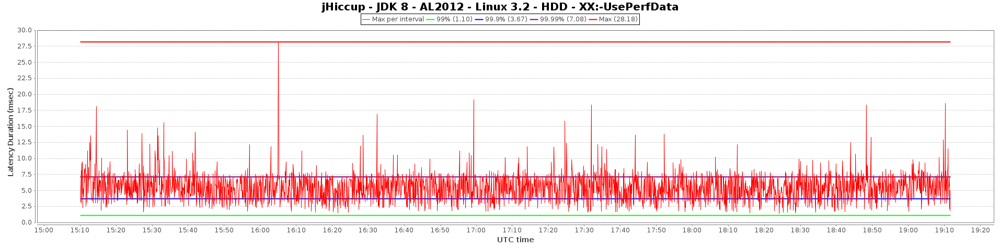 |
|-------|
| 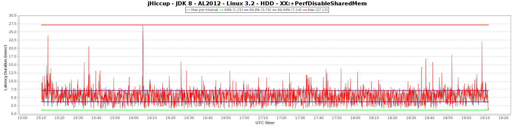 |

As you can see, the results are almost identical. This gives us conclusive evidence that merely collecting the counters without writing them to a shared memory file (i.e. `-XX:+PerfDisableSharedMem`) doesn't generate any latency overhead compared to disabling hsperf counters altogether (i.e. `-XX:-UsePerfData`).

The next two graphs are from the JVMs which ran at the same time but with default settings (i.e. `-XX:-PerfDisableSharedMem`) and with the new `-XX:+PerfAsyncSharedMem` respectively.

| 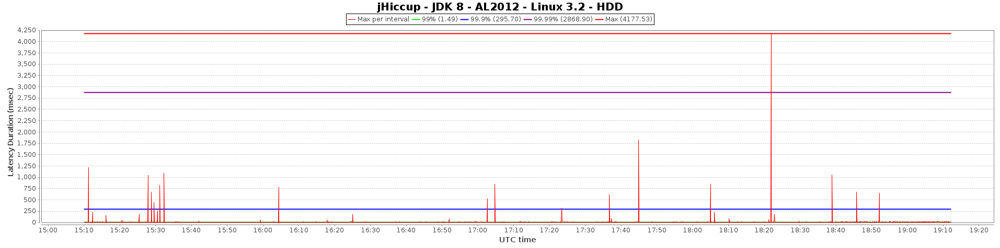 |
|-------|
| 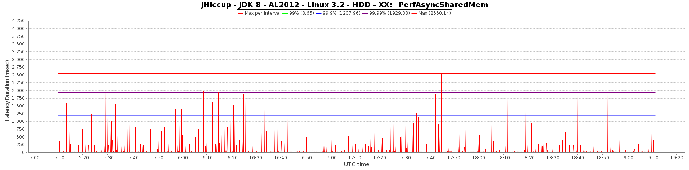 |

With the default settings we can clearly see that the maximum latency increases up to more than 4000ms. Unfortunately, writing the Jvmstat memory region asynchronously to the memory mapped file, doesn't really help a lot. While it decreases the peak pause times to ~2500ms, the P99.9% (1200ms) is still way above the P99.9% (3.7ms) without the memory mapped file. The reason why asynchronously writing the hsperf data doesn't really help is currently unclear to me and requires more investigation.

##### AL 2012 / JDK 11

Next we'll present the results of running the same experiment with JDK 11 (with `-XX:+UseParallelGC`) instead of JDK 8.

| 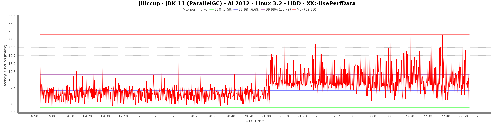 |
|-------|
| 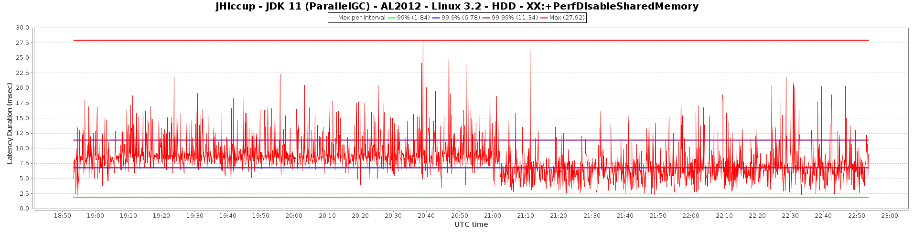 |

Thr first two graphs for `-XX:-UsePerfData` and `-XX:+PerfDisableSharedMem` show similar results like JDK 8.

| 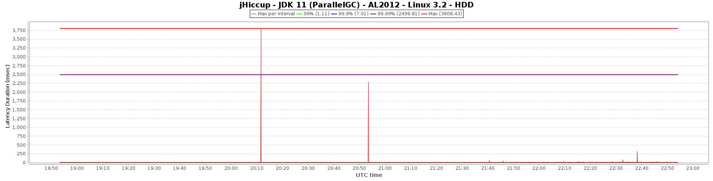 |
|-------|
| 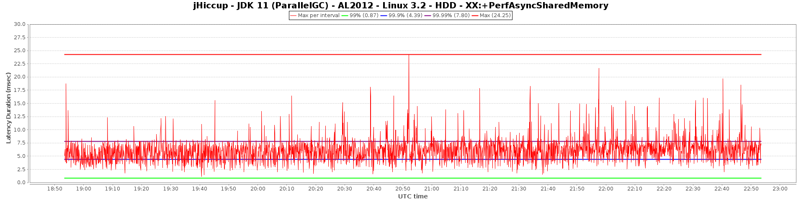 |

For the default configuration, JDK 11 is better at P99.9% (i.e. ~7ms vs. ~290ms) but still similar at P99.99% and P100%. The real surprise comes with the new and experimental `-XX:+PerfAsyncSharedMem` option which delivers similar results on JDK 11 like `-XX:-UsePerfData` and `-XX:+PerfDisableSharedMem`
##### AL 2012 / JDK 17

Finally the results of same experiment with JDK 17 (with `-XX:+UseParallelGC`).

| 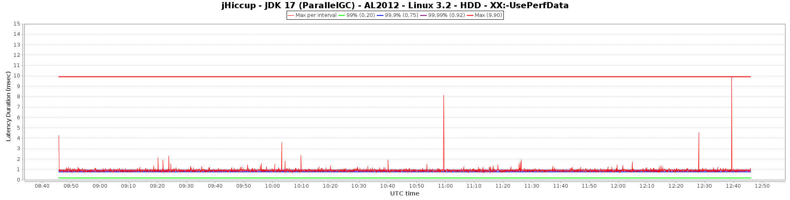 |
|-------|
| 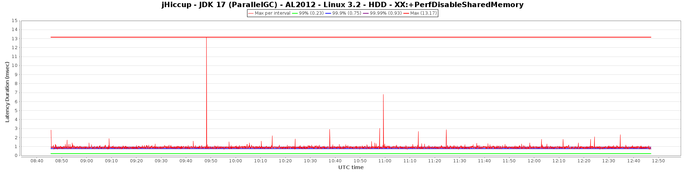 |

As you can see, there have been some nice latency-related improvements between JDK 8 and 17 which leads to P99.99% going down from ~7ms to under 1ms if either shared memory for hsperf is disabled (i.e. `-XX:+PerfDisableSharedMem`) or performance counters are disabled completely (i.e. `-XX:-UsePerfData`).

The latency with enabled shared memory (i.e. with the default `-XX:-PerfDisableSharedMem`) improved as well, although it still shows considerable pauses up to +1700ms:

| 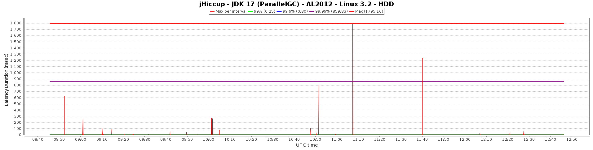 |
|-------|
| 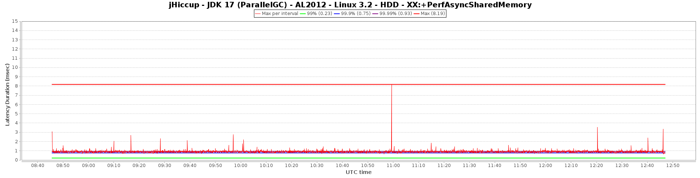 |

But with JDK 17, writing the hsperf counters asynchronously with the new `-XX:+PerfAsyncSharedMem` option helps as well and brings the latency down to the same level like with `-XX:+PerfDisableSharedMem`.

##### AL 2012 / JDK HEAD (20)

| 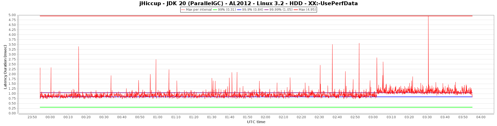 |
|-------|
| 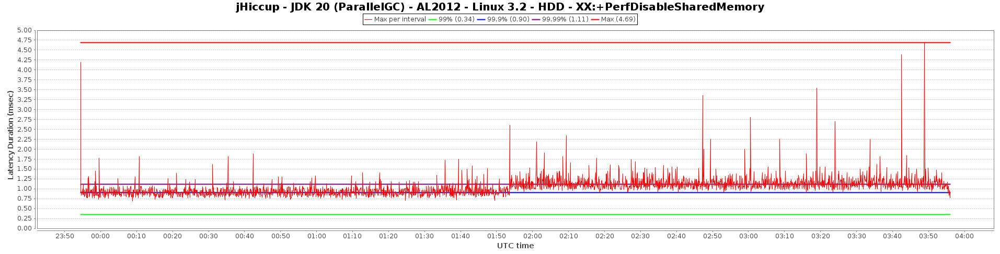 |

| 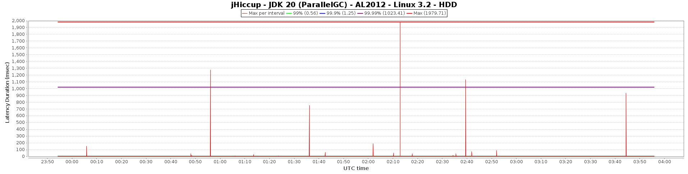 |
|-------|
| 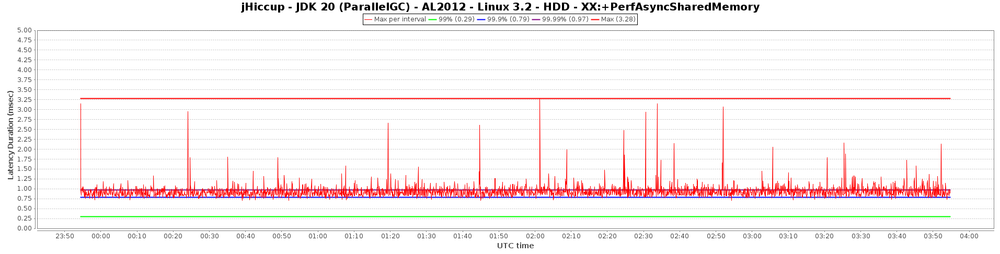 |

#### Amazon Linux 2012 / kernel 3.2 / HDD (with `/tmp/hsperfdata_<user>` in tmpfs)

So far we've seen that using a memory mapped hsperf data file can indeed lead to significant pauses. In this experiment we will mount the `/tmp/hsperfdata_<user>` directory to RAM by using a `tmpfs` file system:
```
$ sudo mount -t tmpfs -o size=1M,uid=`id -u`,gid=`id -g`,mode=755 tmpfs /tmp/hsperfdata_ec2-user
```
Notice that we can't simply create a symlink from `/tmp/hsperfdata_<user>` to e.g. `/dev/shm` because the JVM will refuse to use `/tmp/hsperfdata_<user>` if it is a symlink for security reasons. We also can't change the location the location of the hsperf data directory by setting the [`TMPDIR`](https://pubs.opengroup.org/onlinepubs/000095399/basedefs/xbd_chap08.html) environment variable or the Java [`java.io.tmpdir`](https://docs.oracle.com/en/java/javase/17/docs/api/java.base/java/lang/System.html#getProperties()) system property (see [JDK-6938627](https://bugs.openjdk.org/browse/JDK-6938627) and [JDK-7009828](https://bugs.openjdk.org/browse/JDK-7009828) for why).

| 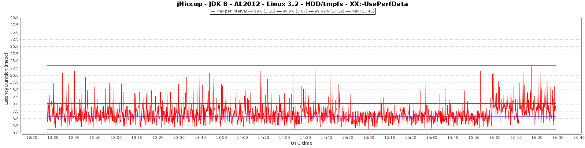 |
|-------|
| 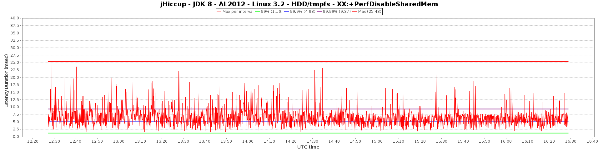 |

The results without memory mapped and disabled hsperf counters are similar to the previous results.

| 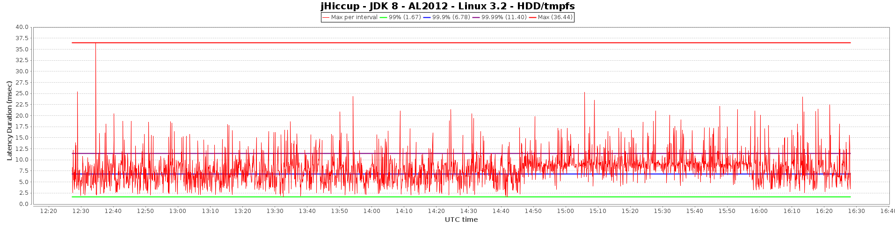 |
|-------|
| 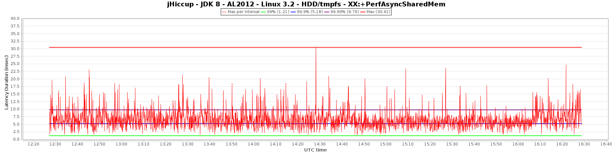 |

However now both the results for enabling hsperf as well as asynchronous hsperf don't incur in any significant overhead. This clearly confirms that the latencies observed before are mostly caused by disk I/O.

#### Amazon Linux 2012 / kernel 3.2 / HDD with diagnostic command

For this experiment we've created a [simple diagnostic command](https://github.com/simonis/jdk8u-dev/tree/DCmd_VM.perf_data) (`VM.perf_data`) which returns the raw contents of the hsperf data memory. This way we can run the the JVM without memory mapped hsperf file (i.e. `-XX:+PerfDisableSharedMem`) but still access the counters through the diagnostic command.

In order to avoid interference when querying the data, we haven't used JDK's `jcmd` command, which spins up a brand new JVM on every invocation, but instead a [slightly patched](https://github.com/simonis/jattach) version of Andrei Pangin's native [`jattach`](https://github.com/jattach/jattach) utility.

| 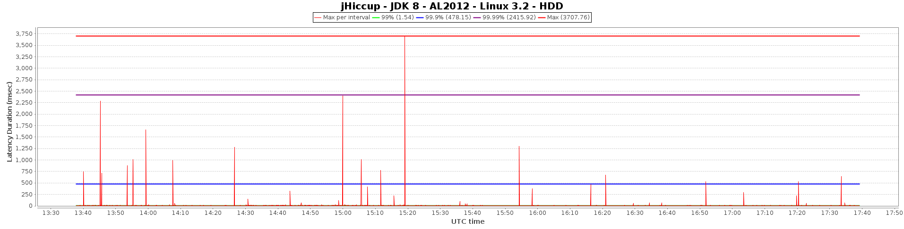 |
|-------|
| 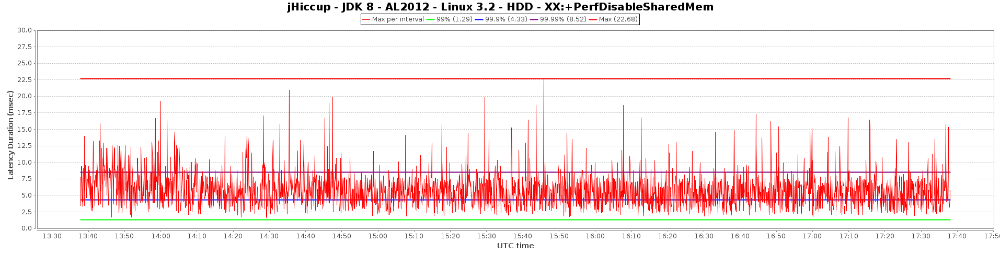 |

The control runs with and without memory mapped hsperf counters are similar to the original results.

For the following two graphs we ran with `-XX:+PerfDisableSharedMem` but executed `jattach <pid> -i 1000 jcmd VM.perf_data` and `jattach <pid> -i 60000 jcmd VM.perf_data` in parallel which called the new `VM.perf_data` diagnostic command once a second and once a minute respectively:

| 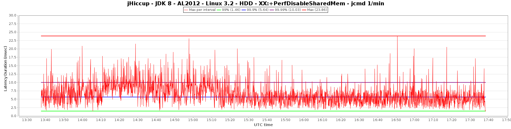 |
|-------|
| 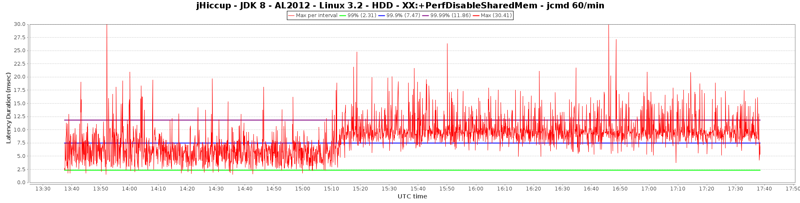 |

As you can see, the additional execution of the diagnostic command does not introduce any significant latency.

#### Amazon Linux 2012 / kernel 3.2 / HDD with `process_vm_readv`

Instead of writing a custom diagnostic command to access the JVM's private hsperf data we can just as well find and read this data from a JVM process by leveraging the structures of HotSpot's [Serviceability Agent](https://openjdk.org/groups/hotspot/docs/Serviceability.html#bsa) and the [`process_vm_readv()`](https://man7.org/linux/man-pages/man2/process_vm_readv.2.html) system call. More details about this approach proposed by [Andrei Pangin](https://twitter.com/AndreiPangin) can be found in his [hsperf GitHub project](https://github.com/apangin/hsperf).

| 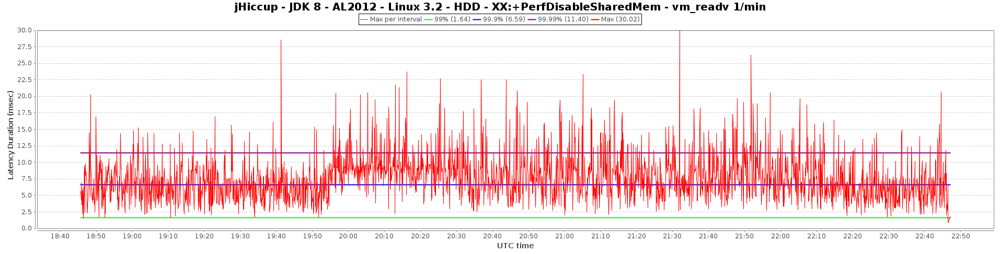 |
|-------|
| 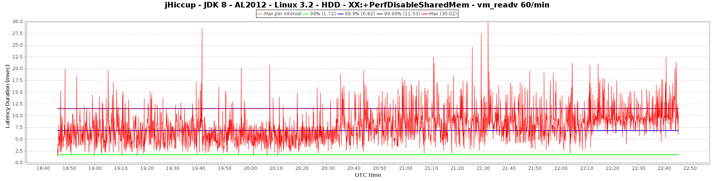 |

As can be seen from the graphs, reading the hsperf data once per minute or once per second with `process_vm_readv()` incurs in no addition latency overhead. They were produced by running a [slightly patched version of hsperf](https://github.com/simonis/hsperf) as `hsperf <pid> -i 1000` / `hsperf <pid> -i 60000` in addition to the Java processes.

#### Amazon Linux 2012 / kernel 3.2 / SSD

This is the same experiment like the first one (i.e. [Amazon Linux 2012 / kernel 3.2 / HDD](#amazon-linux-2012--kernel-32--hdd)) but instead of the "standard" HDD we are now using SSD backed "gp2" storage. We again start with the results without or without memory mapped hsperf data which is quite similar to the original numbers:

| 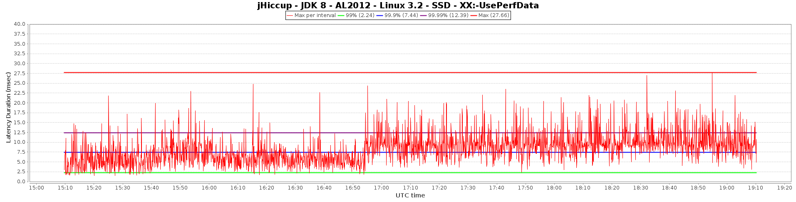 |
|-------|
| 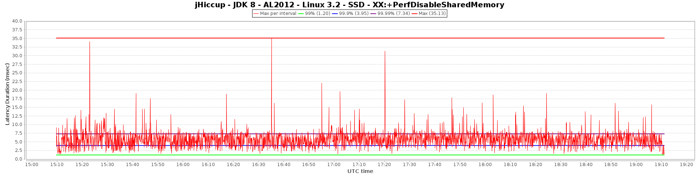 |

However, the results with memory mapped and asynchronously written hsperf counters are a little disappointing:

| 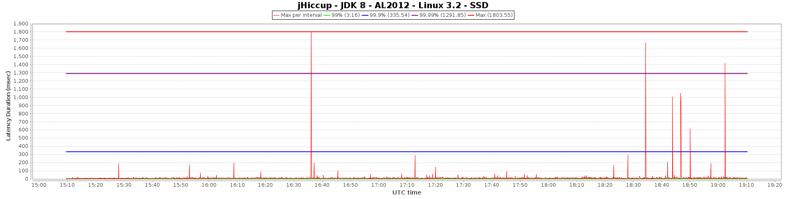 |
|-------|
| 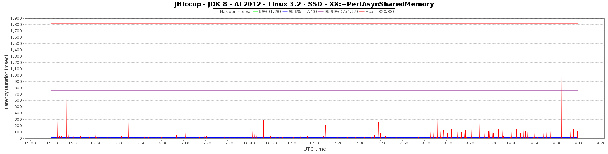 |

While the pauses are clearly smaller compared to the HDD variants, they are still significantly higher than without hsperf. It is unclear why SSD based storage doesn't perform significantly better than HDD storage. One of the reasons might be that both of them are connected via network (i.e. [EBS]((https://aws.amazon.com/ebs/))) to the instances. We might have to try with [local instance storage](https://docs.aws.amazon.com/AWSEC2/latest/UserGuide/InstanceStorage.html) to get clearer results.
#### Amazon Linux 2018 / kernel 4.14 / HDD

##### AL 2018 / JDK 8

| 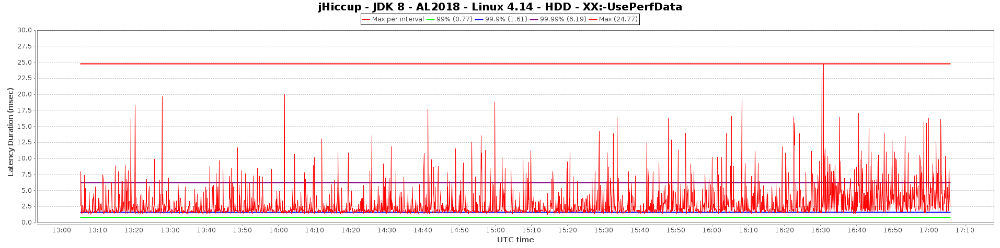 |
|-------|
| 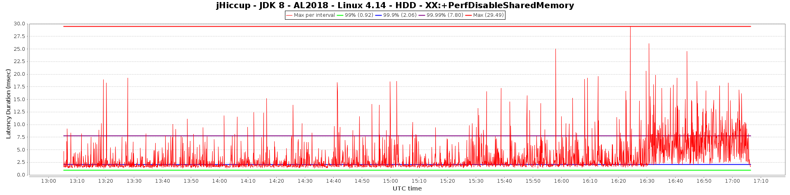 |


| 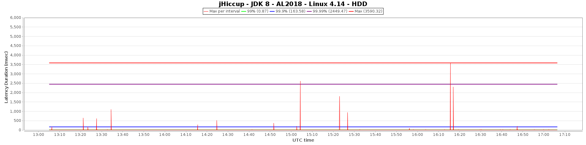 |
|-------|
| 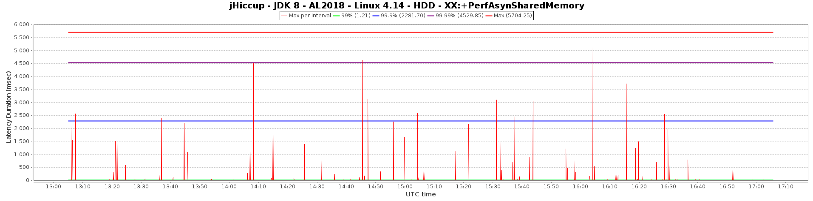 |

##### AL 2018 / JDK 11

| 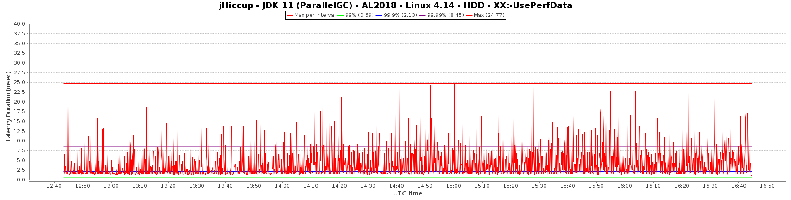 |
|-------|
| 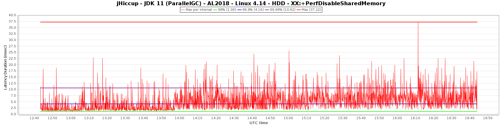 |


| 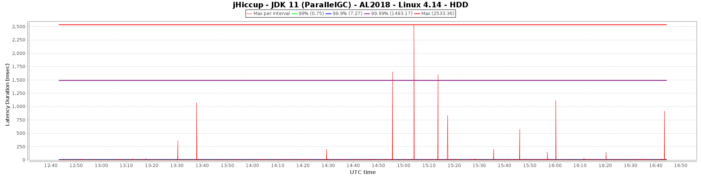 |
|-------|
| 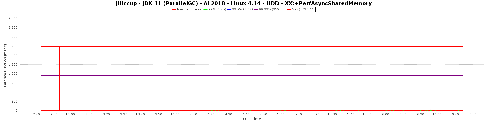 |

For some reason, `-XX:+PerfAsyncSharedMemory` doesn't seem to help for JDK 11 on kernel 4.14 (needs more investigation).

##### AL 2018 / JDK 17

| 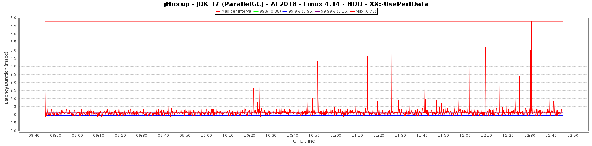 |
|-------|
| 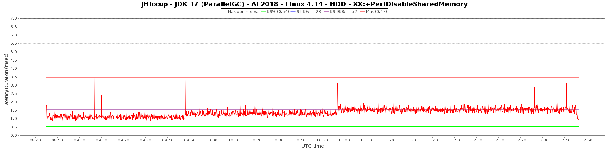 |


| 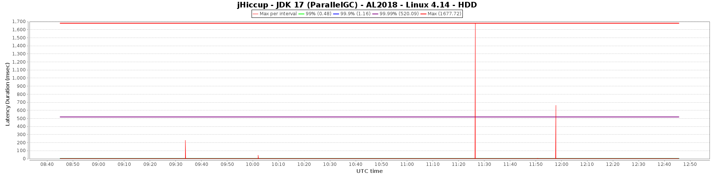 |
|-------|
| 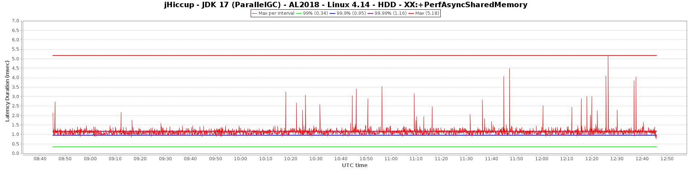 |

For JDK 17 `-XX:+PerfAsyncSharedMemory` seem to help for on kernel 4.14 (needs more measurements to verify if this is really true).

##### AL 2018 / JDK HEAD (20)

We also get contradicting results for JDK HEAD (i.e. 20) on kernel 4.14. In the first measurement we have no pauses in the default configuration (i.e. with shared memory) but a long pause with `-XX:+PerfAsyncSharedMemory`:
| 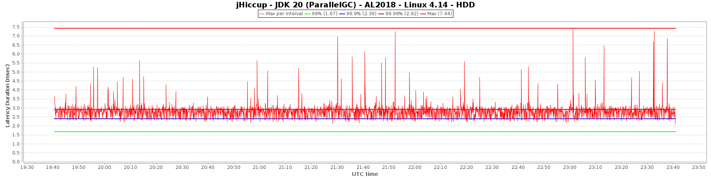 |
|-------|
| 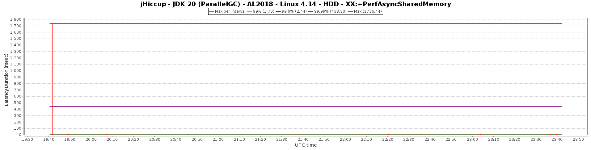 |

In the second measurement we see the opposite behavior. With the default setting we get quite some pauses whereas the JVM with `-XX:+PerfAsyncSharedMemory` runs without any hiccups:

| 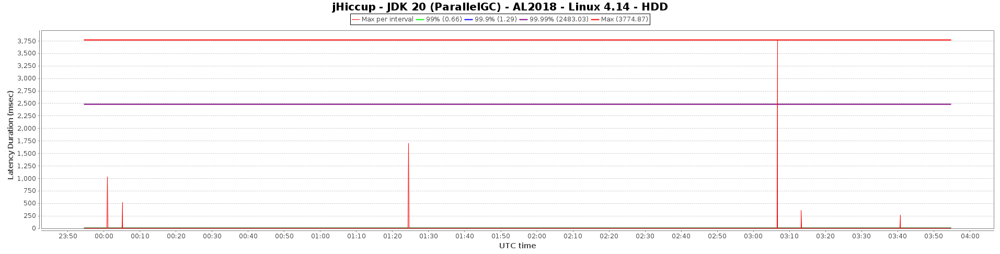 |
|-------|
| 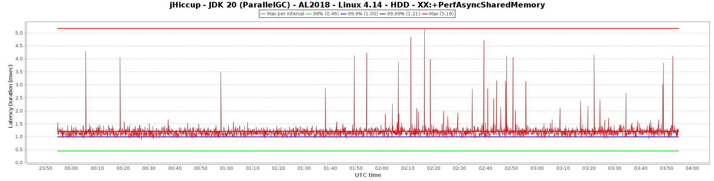 |

These results are similar to the ones for JDK 11 on AL 2018. We need more and potentially longer measurements in order to find a definitive answer.
#### Amazon Linux 2023 / kernel 5.10 / HDD

##### AL 2023 / JDK 8

| 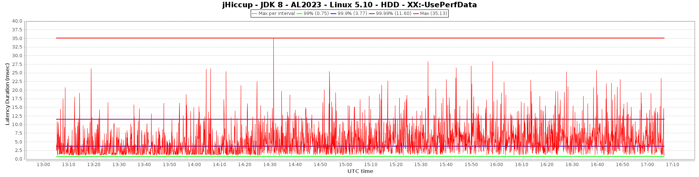 |
|-------|
| 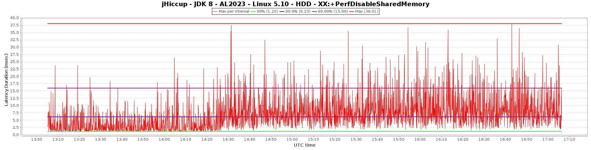 |


| 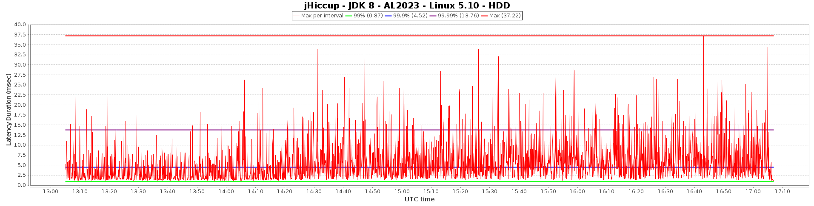 |
|-------|
| 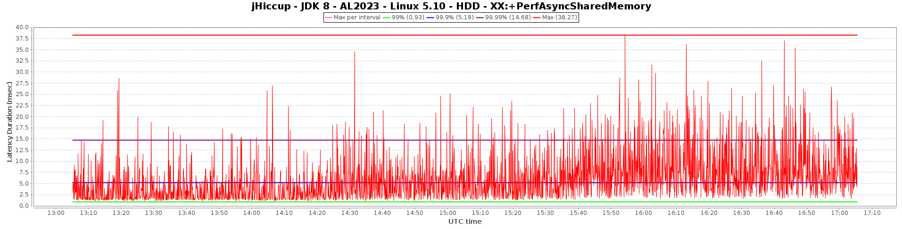 |

##### AL 2023 / JDK 17

| 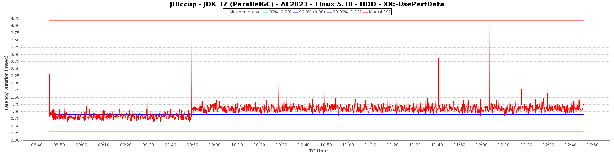 |
|-------|
| 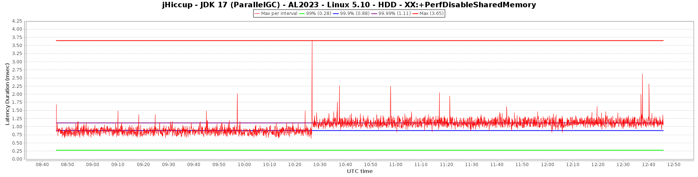 |


| 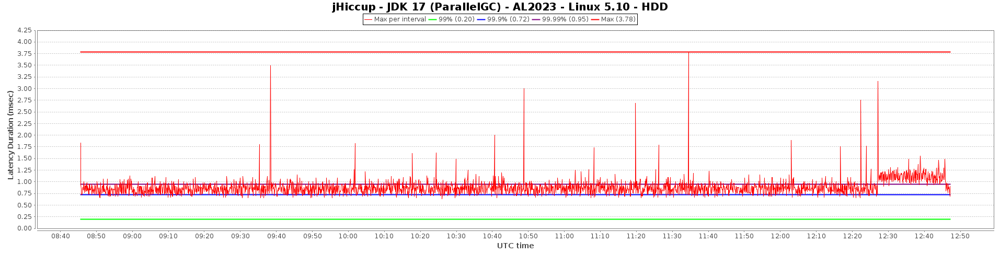 |
|-------|
| 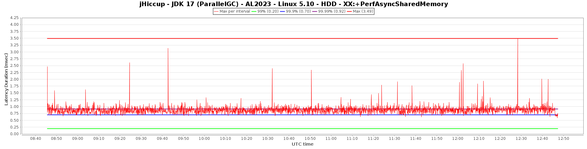 |

##### AL 2023 / JDK HEAD (20)

| 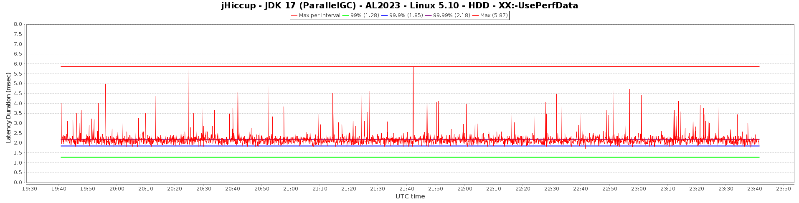 |
|-------|
| 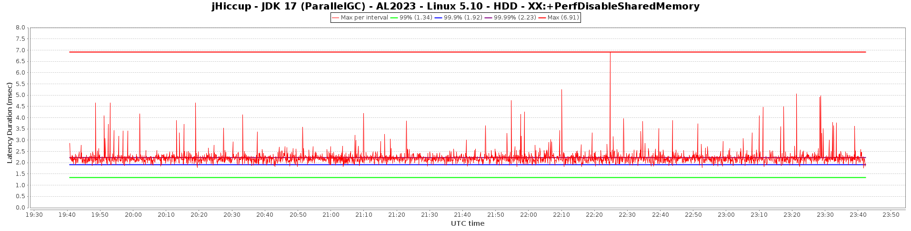 |


| 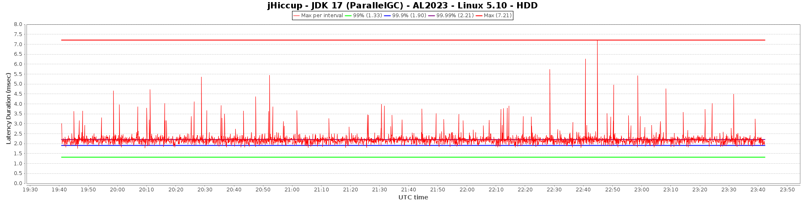 |
|-------|
| 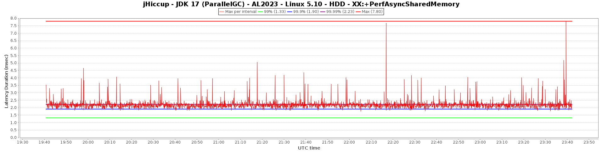 |


#### Generating latency histograms from GC/Safepoint logs

Instead of using the jHiccup library to measure latencies we could have just as well relied on the safpoint times logged by the JVM. For JDK 8 we ran with `-XX:+PrintGCApplicationStoppedTime` which in [contrast to its name](https://stackoverflow.com/a/29673564) logs not only  the time the JVM was stopped during a GC but in fact the time it was stopped during a safepoint. The log output looks as follows for each safepoint:
```
2023-03-08T15:10:02.498+0000: Total time for which application threads were stopped: 0,0024133 seconds, Stopping threads took: 0,0002107 seconds
```

As described in the [jHiccup README](https://github.com/giltene/jHiccup#using-jhiccup-to-process-latency-log-files), the utility can also be used to generate histograms from GC log files. The [jdk8log2hlog.sh](./jdk8log2hlog.sh) script basically extracts the "*time for which application threads were stopped*" from the log file and feeds it to jHiccup which generates a histogram from the data.

If we take the log file [java8x4_jh-async-on_c4_2.txt.gz](./results_al2012_c4/java8x4_jh-async-on_c4_2.txt.gz) which corresponds to the "*`-XX:+PerfAsyncSharedMem` plot for JDK 8 on AL2012*" from above and process it with our script:

```bash
$ ./jdk8log2hlog.sh results_al2012_c4/java8x4_jh-async-on_c4_2.txt.gz
$ ls -l results_al2012_c4/java8x4_jh-async-on_c4_2.hlog
-rw-r--r-- 1 simonisv domain^users 713855 Mär 15 20:01 results_al2012_c4/java8x4_jh-async-on_c4_2.hlog
```

this will create a histogram which is very similar to the original jHiccup chart of that run:

|  |
|-------|
| 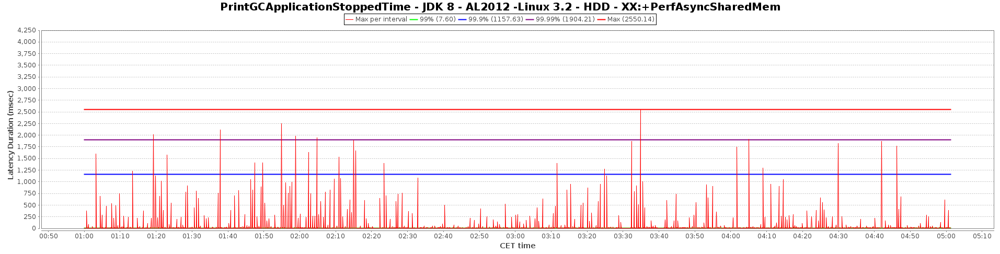 |

For JDK 17 we use `-Xlog:safepoint` instead of `-XX:+PrintGCApplicationStoppedTime` which has a slightly different output format:
```
[0,246s][info][safepoint] Safepoint "ParallelGCFailedAllocation", Time since last: 228071482 ns, Reaching safepoint: 104050 ns, At safepoint: 4960664 ns, Total: 5064714 ns
```

We can now use the [`jdk17log2hlog.sh`](./jdk17log2hlog.sh) script to extract the "*Total:*" safepoint times and feed them to jHiccup to create a safepoint histogram. For the "*`-XX:-UsePerfData` graph for JDK 17 on AL 2012*" shown before which corresponds to the [java17x4_jh-no-perf_c4_1.txt.gz](results_al2012_c4/java17x4_jh-no-perf_c4_1.txt.gz) log file we create the histogram as follows:
```bash
$ ./jdk17log2hlog.sh results_al2012_c4/java17x4_jh-no-perf_c4_1.txt.gz
$ ls -l results_al2012_c4/java17x4_jh-no-perf_c4_1.hlog
-rw-r--r-- 1 simonisv domain^users 419827 Mär 15 21:46 results_al2012_c4/java17x4_jh-no-perf_c4_1.hlog
```

|  |
|-------|
| 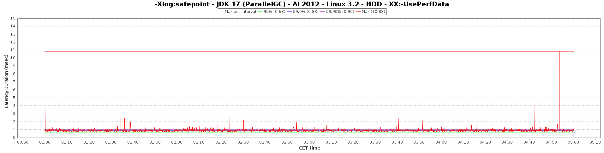 |

Again, the new graph looks quite similar except for a single ~8ms pause (at about 11:00 in the original graph) which doesn't seem to be caused be a safepoint.

### Discussion and Conclusion

- Usage of `-XX:-PerfDisableSharedMem` still introduces significant pauses even with JDK 17 on AL 2012.
- We can confirm that the pauses are related to disk I/O, because they disappear if we mount the hsperf data directory to a memory file system like tmpfs.
- Using SSD storage doesn't improve the situation much over HDD (but have to confirm this by using instance local storage instead of EBS).
- The average pause times have decreased from JDK 8 to 17.
- We need to investigate why writing the hsperf counters asynchronously (i.e. `-XX:+PerfAsyncSharedMem`) doesn't help for JDK 8 but at the same time almost entirely eliminates hsperf related pauses on JDK 11 and 17?
### Future work

There are still a lot of dimensions to this problem worth exploring:
- Test with different GCs
- Test on various file systems
- Test with different storage systems (i.e. instance storage vs. EBS, GP2/GP3, etc..)
- Test with hsperf data file in tempfs
- Test with different mount options (e.g. [noatime/relatime/lazytime](https://en.m.wikipedia.org/wiki/Stat_%28system_call%29#NOATIME), aso see "[Introducing lazytime](https://lwn.net/Articles/621046/)")
- Try to compact all frequently updated counters into s single page/block
